# tweeter — curated Twitter sources for a macro/geo/Brazil intelligence agent

> **197 Twitter (X) accounts** feeding a multilingual financial-intelligence pipeline.
> Annotated with **who** each user is, **why** they're tracked, and **how** the
> system filters their tweets before storage.

This is the live follow list behind the M3xA intelligence system. Sibling repos:

- [`m3xa-core`](https://github.com/prcodex/m3xa-core) — the House pattern (architecture, didactic)
- [`chunking_vector`](https://github.com/prcodex/chunking_vector) — the v5 RAG spec (Bedrock-native, anonymized)
- [`M3XABR_NEW`](https://github.com/prcodex/M3XABR_NEW) — the expertise-composition slice

Where the architecture docs use anonymized aliases (`Bank1`, `Expert1`, `Podcast1`), **this repo uses real handles**. Twitter accounts are public follows, not paid subscriptions — the curation is the value, and aliasing it would defeat the point.

The list below is pulled from the live `source_classifications.db` via the Sources Manager (port 8551, endpoint `/api/twitter-accounts`). Each account is tagged with one of two priority tiers:

- **VIP / high** — junk filter bypassed, weight ≥ 1.0, every tweet stored
- **Normal / low** — AI ranker applies, weight ≤ 0.8, only tweets scoring ≥6 stored

## Table of contents

- [How to read this list](#how-to-read-this-list)
- [A. Brazil domain — 69 accounts](#a-brazil-domain--69-accounts)
  - [A.1 VIP / high-priority — political columnists, analysts, key voices (40)](#a1-vip--high-priority--political-columnists-analysts-key-voices-40)
  - [A.2 Normal priority — outlets, politicians, supporting (29)](#a2-normal-priority--outlets-politicians-supporting-29)
- [B. Macro / Geo domain — 128 accounts](#b-macro--geo-domain--128-accounts)
  - [B.1 Macro — rates, FX, fiscal, central banks, markets (~100)](#b1-macro--rates-fx-fiscal-central-banks-markets-100)
  - [B.2 Geo — Iran, Russia/Ukraine, great-power, defense (~28)](#b2-geo--iran-russiaukraine-great-power-defense-28)
- [Filtering process — trash filter + AI ranking](#filtering-process--trash-filter--ai-ranking)
- [twitterapi.io vs Twitter/X API — why we use twitterapi.io](#twitterapiio-vs-twitterx-api--why-we-use-twitterapiio)
- [Stats](#stats)
- [How to reproduce](#how-to-reproduce)

---

## How to read this list

| Field | Meaning |
|---|---|
| Handle | `@username` on X |
| Tier | `VIP` (junk_bypass=true, every tweet stored) or `normal`/`low` (AI-ranked, threshold ≥6 of 10) |
| Role | What they cover |
| Notes | When provided — context on signal type, related sources, quirks |

Entries are ordered roughly by curation depth — the most-annotated handles at the top of each section are the highest-signal sources; the compact-table entries near the bottom are supporting / outlet / lower-volume accounts that still get ingested but don't drive much synthesis.

The live registry is the source of truth. This README is a snapshot — accounts get added and rotated over time. To regenerate from the live API:

```bash
ssh gateway 'curl -s localhost:8551/api/twitter-accounts | jq'
```

---

## A. Brazil domain — 69 accounts

> Storage filter: `domain = 'brazil'` in LanceDB. Bot: `@M3xabr_bot`.
> Routing: `/api/rag` with `filters=['brazil']`.

Brazilian Twitter is dominated by political columnists, judicial-track journalists, fiscal-policy economists, and partisan commentators. The list reflects that: heavy on Brasília columnists (UOL, Folha, Estadão, O Globo, JOTA), light on bank-research handles (Brazilian banks publish via email research notes, not Twitter).

### A.1 VIP / high-priority — political columnists, analysts, key voices (40)

These are the **40 accounts** marked `is_vip=true, priority=high` in the registry. Trash filter bypassed; every tweet stored.

#### Top-tier political columnists (Brasília beat)

##### `@danielalima` — Daniela Lima (UOL / GloboNews)
- **Role:** Brasília political columnist; STF and Esplanada coverage
- **Notes:** Cross-referenced with her UOL columns scraper (`uol_columnists` cron). Strong direct-source access on cabinet shuffles and coalition signals.

##### `@reinaldoazevedo` — Reinaldo Azevedo (UOL, ex-Veja)
- **Role:** Political commentator; analytical, often contrarian framing
- **Notes:** Lens distinct from Lima / Bergamo — useful for both-sides synthesis on contentious topics.

##### `@monicabergamo` — Mônica Bergamo (Folha de SP)
- **Role:** Brasília + social/political columnist; high-volume, direct sources
- **Notes:** Folha column is the primary signal; Twitter adds the breaking-flag layer.

##### `@malugaspar` — Malu Gaspar (Revista Piauí, ex-O Globo)
- **Role:** Long-form investigative; deep political-economy reporting
- **Notes:** Lower tweet volume, very high signal density per tweet.

##### `@laurojardim` — Lauro Jardim (O Globo)
- **Role:** Brasília columnist; daily political-economy beat (Coluna do Lauro Jardim)
- **Notes:** Direct-source access on cabinet and Centrão moves.

##### `@ecantanhede` — Eliane Cantanhêde (Estadão / GloboNews)
- **Role:** Senior political columnist; institutional / Esplanada coverage

##### `@eliogaspari` — Élio Gaspari (Folha column)
- **Role:** Veteran political columnist + biographer (military dictatorship history series)
- **Notes:** Twitter very low volume — used as a flag when he weighs in.

##### `@miriamleitao` — Miriam Leitão (O Globo / GloboNews)
- **Role:** Senior economics columnist; fiscal, monetary, market-macro framing

##### `@gcamarotti` — Gerson Camarotti (GloboNews)
- **Role:** Brasília political reporter; coalition + STF coverage

##### `@dorakramer` — Dora Kramer (Veja, ex-Estadão)
- **Role:** Political columnist; institutional analysis

##### `@feliperecondo` — Felipe Recondo (JOTA, co-founder)
- **Role:** STF / judicial coverage; co-author of "Os Onze"
- **Notes:** "Recondo e os Onze" Substack also scraped (`recondo_substack` cron). The pre-eminent STF watcher.

##### `@guganoblat` — Guga Noblat (jornalista político)
- **Role:** Political journalist; long-form interviews + commentary

##### `@gabisvalente` — Gabriela Valente (jornalista política)
- **Role:** Brasília political reporting

##### `@igorgadelham` — Igor Gadelha (Metrópoles, ex-Folha)
- **Role:** Brasília beat; political-investigative

##### `@adrianafernandes` — Adriana Fernandes (Estadão)
- **Role:** Economic policy / fiscal beat

##### `@ancelmocom` — Ancelmo Gois (O Globo)
- **Role:** Social-political column; Brasília gossip with substance

##### `@colunach` — Coluna do Chacra (Guga Chacra / Globo)
- **Role:** International + foreign-policy column (Brazil-foreign affairs intersection)

##### `@pfigueiredo08` — Paulo Figueiredo (right-leaning commentator)
- **Role:** Conservative political commentary; high reach on Bolsonarist audience
- **Notes:** Different lens — necessary for both-sides synthesis on Brazil's polarized political coverage.

##### `@augustosnunes` — Augusto Nunes (Veja / Pânico)
- **Role:** Right-leaning political commentary

##### `@claudio_dantas_` — Cláudio Dantas (Crusoé)
- **Role:** Investigative political reporter

##### `@radaronline` — Radar (Veja's "Radar" political column aggregate)
- **Role:** Outlet-style political breaking; multiple authors

##### `@jotainfo` — JOTA (judicial coverage outlet)
- **Role:** STF + Congresso + STF-watcher institutional outlet
- **Notes:** Recondo co-founded JOTA — adjacent to `@feliperecondo`. Pair them on STF queries.

#### Economists and fiscal-policy voices

##### `@alexschwartsman` — Alexandre Schwartsman (ex-BCB director)
- **Role:** Independent macro economist, monetary policy + fiscal
- **Notes:** Best independent voice on Selic / Copom analysis on Brazilian Twitter.

##### `@anapaulavescovi` — Ana Paula Vescovi (Santander Brasil, ex-Tesouro)
- **Role:** Macro + fiscal economist
- **Notes:** Bridges sell-side and policy — was Secretary of Treasury under Temer.

##### `@asachsida` — Adolfo Sachsida (economista, ex-ministro)
- **Role:** Conservative-leaning economist
- **Notes:** Ex-Minister of Mines and Energy in Bolsonaro government.

##### `@marcoscintra` — Marcos Cintra (economista, ex-Receita Federal)
- **Role:** Fiscal policy commentary
- **Notes:** Known for the "single-tax" (imposto único) proposal.

##### `@alex_ribeiro_valor` — Alex Ribeiro (Valor Econômico)
- **Role:** BCB beat reporter for Valor
- **Notes:** Closest thing to a Brazilian Nick Timiraos — Copom-watcher signal.

#### Political analysts and consultancies

##### `@lucasdearagao` — Lucas de Aragão (Arko Advice)
- **Role:** Political-risk consultant; Brasília articulation analysis
- **Notes:** One of the most-cited political-consultancy voices for institutional investors.

##### `@lucianodiascac` — Luciano Dias (CAC Consultoria)
- **Role:** Political analyst; campaign + electoral consultancy

##### `@centraldireitab` — Central Direita Brasil
- **Role:** Right-leaning political aggregator / outlet

##### `@eixopolitico` — Eixo Político
- **Role:** Political analysis outlet (multiple contributors)

#### Politicians (direct statements)

##### `@romeuzema` — Romeu Zema (Governor of Minas Gerais, Novo)
- **Role:** Sitting governor; fiscal-conservative voice from a major state

##### `@gilbertokassab` — Gilberto Kassab (PSD president, ex-mayor of São Paulo)
- **Role:** Center-right political broker; PSD coalition signals

##### `@carlosbolsonaro` — Carlos Bolsonaro (Rio de Janeiro vereador, Bolsonaro family)
- **Role:** Bolsonaro family social-media operator
- **Notes:** Tracked for direct-statements signal from the Bolsonaro inner circle.

##### `@bolsonarosp` — Bolsonaro SP-related account
- **Role:** Bolsonaro / right-wing political account (state-level)

#### Other VIP / high-tier

##### `@albertocalmeida` — Alberto Calmeida (verify)
- **Role:** Brazilian political commentator

##### `@guedinhoefans` — Paulo Guedes fan / parody account
- **Role:** Right-leaning macro commentary (light)

##### `@jotinha` — verify
- **Role:** Brazilian political commentator

##### `@sampancher` — verify
- **Role:** Brazilian political commentator

##### `@revistaoeste` — Revista Oeste (outlet)
- **Role:** Right-leaning print + digital outlet

### A.2 Normal priority — outlets, politicians, supporting (29)

These get the AI rank filter (threshold ≥6). They're tracked but not VIP — useful for breadth, not always per-tweet signal.

#### Outlet corporate accounts

| Handle | Outlet | Role |
|---|---|---|
| `@folha` | Folha de S.Paulo | Major daily, center-left |
| `@valoreconomico` | Valor Econômico | Premier financial daily |
| `@estadao` | O Estado de S.Paulo | Major daily, center-right |
| `@cnnbrasil` | CNN Brasil | TV news + political coverage |
| `@metropoles` | Metrópoles | Brasília-based digital outlet |
| `@o_antagonista` | O Antagonista | Right-leaning political outlet |
| `@infomoney` | InfoMoney | Financial markets news |
| `@poder360` | Poder360 | Political analysis + polling aggregator |

#### Politicians + political accounts

| Handle | Who | Role |
|---|---|---|
| `@tarcisiogdf` | Tarcísio de Freitas | Governor of São Paulo (PL) |
| `@nikolas_dm` | Nikolas Ferreira | Federal deputy (PL); top right-wing social-media reach |
| `@joaodamoedo` | João Amoêdo | Novo founder, ex-presidential candidate |

#### Columnists + analysts (normal tier)

| Handle | Who | Outlet/Role |
|---|---|---|
| `@traumann` | Thomas Traumann | Independent political analyst; "Diálogos" newsletter |
| `@blogdonoblat` | Ricardo Noblat | Veteran political columnist |
| `@demori` | Leandro Demori | Investigative reporter (ex-Intercept Brasil) |
| `@robertoelleryjr` | Roberto Ellery Jr. | Economist (UnB), Twitter macro analyst |
| `@pfnery` | Pedro Fernando Nery | Economist (Insper) |
| `@rconstantino` | Rodrigo Constantino | Conservative commentator |
| `@marsiglia_andre` | André Marsiglia | Lawyer / CNN Brasil commentator |
| `@lsantanna` | Lourival Sant'anna | International affairs columnist (Estadão) |
| `@augustodeab` | Augusto de Arruda Botelho (verify) | Lawyer / political commentator |

#### Polling and electoral trackers

| Handle | Who | Role |
|---|---|---|
| `@pesquisas_elige` | Pesquisas Elige | Polling tracker (electoral) |
| `@eleicaobr2026` | Eleição BR 2026 | Election cycle tracker |

#### Other (lower-recognition or to verify)

| Handle | Notes |
|---|---|
| `@ambrosi_bispo` | Brazilian commentator (verify) |
| `@andreazzaeditor` | Editor (verify) |
| `@andreshalders` | (verify) |
| `@danleich` | (verify) |
| `@dbelemlopes` | (verify) |
| `@fr_bsb` | Brasília-tagged account (verify) |
| `@fzambeli` | Brazilian journalist (verify) |
| `@joaodamoedo` | João Amoêdo (already covered above) |

> Notes flagged as `(verify)` are accounts in the live registry whose role I haven't independently confirmed. The handles are real and tracked; the role description is best-guess.

### Notes on the Brazil follow list

- **Crossover sources:** Most VIP columnists also have their full columns scraped via the UOL/Folha/Estadão article extractors. Twitter is the breaking-flag layer; the column body is the primary signal.
- **Itaú / XP / BTG:** Brazilian bank research arrives via Gmail (`itau_brazil`, `xp_macro`, `xp_politica` crons), not Twitter. Bank corporate Twitter accounts are deliberately excluded — marketing noise.
- **STF coverage:** `@feliperecondo` + `@jotainfo` form the core. Pair them on judicial queries.
- **Right-wing voices:** `@pfigueiredo08`, `@nikolas_dm`, `@centraldireitab`, `@revistaoeste`, `@augustosnunes` are tracked deliberately for both-sides synthesis — Brazilian political coverage is polarized and the pipeline's editorial rule requires representation from both poles.

---

## B. Macro / Geo domain — 128 accounts

> Storage filter: `domain = 'macro'` in LanceDB. Bot: `@M3xA_bot`.
> Routing: `/api/rag` with `filters=['macro']`.

The macro/geo accounts share the same `domain = macro` partition in the DB. The B.1 / B.2 split below is **editorial, not enforced** — it's a way to make the curation legible. Some accounts (Niall Ferguson, Bremmer) cross both buckets.

### B.1 Macro — rates, FX, fiscal, central banks, markets (~100)

#### VIP wires + breaking

##### `@firstsquawk` — First Squawk (real-time newswire)
- **Role:** Cross-market real-time wire — central bank speakers, geopolitical breaking, data prints
- **Tier:** `low` priority in registry but tracked for breaking-news speed.

##### `@financialjuice` — FinancialJuice
- **Role:** Real-time market headlines aggregator; complements DeItaone (DeItaone has its own dedicated pipeline outside this registry)

##### `@bloomberg` — Bloomberg corporate (VIP)
- **Role:** Catches BBG features and longer pieces

##### `@reuters` — Reuters corporate
- **Role:** Reuters articles also scraped via the gold-daemon RSS path; Twitter adds breaking flags

##### `@wsj`, `@wsjmarkets` — Wall Street Journal corporate + markets desk
##### `@ft`, `@ftmarkets`, `@ftalphaville` (VIP), `@fteconomics`, `@ftbreakingnews` — FT cluster (5 handles)
- **Notes:** Most FT pieces are paywall-gated; Twitter excerpts often carry the gist. Dedicated `ft_twitter_collector.py` pipeline.

##### `@cnbcnow`, `@barronsonline` — TV finance + Barron's

##### `@zerohedge` — ZeroHedge (contrarian aggregator, low weight)

#### Independent macro analysts (VIP / high)

##### `@brad_setser` — Brad Setser (CFR)
- **Role:** EM sovereign credit, capital flows, China economic data

##### `@michaelxpettis` — Michael Pettis (Peking University)
- **Role:** China macro, global imbalances, long-arc framing

##### `@josephpolitano` — Joey Politano (Apricitas)
- **Role:** US economic data interpretation
- **Notes:** Aprecitas blog also scraped (`aprecitas` cron).

##### `@claudiasahm` — Claudia Sahm (former Fed)
- **Role:** US labor market, recession indicators, Fed reaction function

##### `@elerianm` — Mohamed El-Erian (Allianz / Queens')
- **Role:** Macro framing, Fed-watch, global commentary

##### `@truthgundlach` — Jeffrey Gundlach (DoubleLine)
- **Role:** Rates, credit, equity strategy

##### `@macroalf` — Alfonso Peccatiello (The Macro Compass)
- **Role:** Macro framework + market positioning

##### `@nfergus` — Niall Ferguson (Stanford, Greenmantle)
- **Role:** Historical-economic framing of current events

##### `@jnordvig` — Jens Nordvig (Exante Data)
- **Role:** FX, EM, capital flows
- **Notes:** Paired with `@exantedata` (Exante Data corporate, normal-tier).

##### `@robin_j_brooks` — Robin Brooks (Brookings, ex-IIF)
- **Role:** EM capital flows, sanctions impact, sovereign analysis

##### `@charliebilello` — Charlie Bilello (Creative Planning)
- **Role:** Markets data visualization, equity factors, rates

##### `@gave_vincent` — Vincent Gave (Gavekal)
- **Role:** Asia macro, global imbalances

##### `@pantheonmacro` — Pantheon Macroeconomics
- **Role:** Independent macro research shop

##### `@fedguy12` — Joseph Wang ("Fed Guy")
- **Role:** Fed plumbing, repo markets, reserve management

##### `@donnelly_brent` — Brent Donnelly (Spectra Markets)
- **Role:** FX, rates, daily desk commentary
- **Notes:** "Spectra" email also scraped via `brent_donnelly` Gmail cron.

##### `@ericsrosengren` — Eric Rosengren (former Boston Fed)
- **Role:** Former Fed president; rate-cycle commentary

#### Independent macro analysts (normal tier — high signal but smaller volume)

| Handle | Who | Role |
|---|---|---|
| `@econguyrosie` | David Rosenberg (Rosenberg Research) | Bearish macro, recession-skewed framing |
| `@stephen_roach` (entity, may be in @yarotrof region) | Stephen Roach (Yale) | China-US macro, long-arc |
| `@johnauthers` (verify if @robinwigg is John) | John Authers (Bloomberg Opinion) | Macro framing |
| `@robinwigg` | Robin Wigglesworth (FT Alphaville) | Markets columnist |
| `@biancoresearch` | Jim Bianco's research | Independent macro shop |
| `@jimbianco` | Jim Bianco (Bianco Research) | Founder; rates + credit |
| `@conorsen` | Conor Sen (Peachtree Creek Investments) | Macro framing |
| `@jasonfurman` | Jason Furman (Harvard, ex-CEA) | US policy economics |
| `@mtkonczal` | Mike Konczal (Roosevelt) | Heterodox macro |
| `@ianshepherdson` | Ian Shepherdson (Pantheon Macro founder) | US macro data calls |
| `@samro` | Sam Ro (TKer newsletter) | Markets + macro digest |
| `@thestalwart` | Joe Weisenthal (Bloomberg, Odd Lots) | Macro + market structure |
| `@lisaabramowicz1` | Lisa Abramowicz (Bloomberg TV) | Credit + rates |
| `@lizannsonders` | Liz Ann Sonders (Schwab Chief Inv Strategist) | Markets strategy |
| `@lizthomasstrat` | Liz Young Thomas (SoFi/strategist) | Markets strategy |
| `@mrblonde_macro` | Mr Blonde (Macro) | Independent macro pseudonym |
| `@hedgiemarkets` | Hedgie Markets | Macro pseudonym |
| `@fullcarry` | "Full Carry" macro account | FX + rates pseudonym |
| `@jmhorp` | Macro pseudonym | (verify) |
| `@drjstrategy` | Dr. J Strategy | Markets/macro |
| `@biancoresearch` | (already listed) | |
| `@ppgmacro` | Macro account | (verify) |
| `@aprecitas` | Aprecitas blog (Joey Politano's outlet) | Already covered above |
| `@unusual_whales` | Options flow / market data | Options-flow tracker |
| `@johnarnold` | John Arnold (energy macro / ex-Centaurus) | Energy + fiscal-policy commentary |
| `@geo_papic` | Marko Papic (Clocktower) | Geopolitical macro |
| `@macaesbruno` | Bruno Maçães (geopolitics + macro) | Political-economy / great-power |
| `@ozanktarman` | Ozan Aktarman (markets/macro) | (verify) |
| `@gearoidreidy` | Gearoid Reidy (Bloomberg) | Japan correspondent |
| `@havivrettiggur` | Haviv Rettig Gur (Times of Israel) | Geopolitics |
| `@policytensor` | Policy Tensor blog | Political economy / macro |
| `@shanaka86` | (verify) | Macro |
| `@conorsen` | (already listed) | |
| `@andreassteno` | Andreas Steno Larsen (Steno Research) | Macro newsletter |
| `@c_barraud` | Christophe Barraud (Market Securities) | Most-accurate-forecaster award winner |
| `@matthewklein` | (not in this list) | |
| `@armchairw` | Armchair Warlord (geo macro pseudonym, verify) | |
| `@schuldensuehner` | Holger Zschaepitz (Die Welt markets) | Macro + market data |
| `@danobrien20` | (verify) | |
| `@drjstrategy` | (already listed) | |
| `@inartecarlodoss` | (verify) | Markets/macro |
| `@jonathonpsine` | (verify) | Markets/macro |
| `@mylovanov` | Tymofiy Mylovanov (Kyiv School of Economics) | Ukraine macro (also geo) |
| `@dlineminutes` | (verify) | Markets data |
| `@ole_s_hansen` | Ole S. Hansen (Saxo Bank) | Commodities macro |
| `@radigancarter` | (verify) | Markets/macro |
| `@hudsoninstitute` | Hudson Institute think tank | Geo + macro policy |
| `@petereharrell` | Peter Harrell (CFR, ex-NSC) | Geo-economics, sanctions |
| `@thomaserdbrink` | Thomas Erdbrink (NYT, Tehran bureau) | Iran reporting |
| `@sudarsanwpost` | Sudarsan Raghavan (Washington Post) | International reporting |
| `@nytworld` | NYT World corporate | International desk |
| `@davidhpetraeus` | Gen. David Petraeus | Military / national security |
| `@dalrymplewill` | William Dalrymple (historian) | (lower frequency tweets) |
| `@david_luhnow` | David Luhnow (WSJ Latin America bureau chief) | LatAm coverage |
| `@eamonjavers` | Eamon Javers (CNBC) | DC-finance intersection |
| `@carlquintanilla` | Carl Quintanilla (CNBC) | Markets anchor |
| `@mattyglesias` | Matt Yglesias (Slow Boring) | US politics + policy economics |
| `@ichotiner` | Isaac Chotiner (New Yorker) | Long-form political interviews |
| `@mtkonczal` | (already listed) | |
| `@thewarzonewire` | The War Zone (defense) | Already covered (also geo) |
| `@iranintl_en` | Iran International (English) | Already covered (also geo) |
| `@goldmansachs` | Goldman Sachs corporate | Research summary tweets |
| `@bcaresearch` | BCA Research | Independent macro shop |
| `@exantedata` | Exante Data corporate | Companion to `@jnordvig` |
| `@marketreaderinc` | MarketReader | Markets data |
| `@soberlook` | Sober Look | Macro charts |
| `@anz_research` (VIP) | ANZ Bank Research | Asia-Pacific macro |
| `@fongern_fx` | (verify) | FX |
| `@josephwang` | Joseph Wang (CIO Monetary) | Fed plumbing (paired with `@fedguy12`) |
| `@sobel_mark` | Mark Sobel (OMFIF, ex-Treasury) | International finance institution coverage |
| `@sama` | Sam Altman (OpenAI CEO) | Tracked for crossover signals (macro/AI interaction) |
| `@rkelanic` | Rajan Menon / R. Kelanic (verify) | Geo / strategic studies |
| `@anaborsa` | (verify) | Markets/macro |
| `@annaeconomist` | The Economist staff (Anna, verify) | |
| `@matt_yglesias` | (already listed) | |
| `@jackprandelli` | (verify) | Macro/markets |
| `@econberger` | Economic Berger (verify) | |
| `@wikirobin` | (verify) | |
| `@cnbcnow` | CNBC Now corporate | Already covered |

#### Federal Reserve regional banks (8 accounts)

The regional Fed Twitter accounts publish papers, speeches, and economic letters. Lower volume; useful for citation when the user asks about a specific district's research.

| Handle | Bank |
|---|---|
| `@federalreserve` | Federal Reserve Board |
| `@newyorkfed` | New York Fed |
| `@atlantafed` | Atlanta Fed |
| `@bostonfed` | Boston Fed |
| `@dallasfed` | Dallas Fed |
| `@kansascityfed` | Kansas City Fed |
| `@minneapolisfed` | Minneapolis Fed |
| `@sffed` | San Francisco Fed |

#### Other central banks

| Handle | Bank |
|---|---|
| `@bankofengland` | Bank of England |

#### Officials and policy voices (VIP)

| Handle | Who |
|---|---|
| `@secscottbessent` | Scott Bessent — US Treasury Secretary |
| `@howardlutnick` | Howard Lutnick — US Commerce Secretary |
| `@nicktimiraos` | Nick Timiraos — WSJ Fed reporter (THE Fed leak channel) |
| `@raghavanreports` | Anita Raghavan — Wall Street investigative |
| `@yarotrof` | Yaroslav Trofimov — WSJ geopolitical (also geo) |
| `@javierblas` | Javier Blas — Bloomberg commodities (low priority by registry, high by entity rule) |

### B.2 Geo — Iran, Russia/Ukraine, great-power, defense (~28)

Editorially extracted from the macro pool. These cover great-power competition, conflicts, and regional politics — not equity markets.

#### Iran / Middle East (VIP + normal)

| Handle | Who | Role |
|---|---|---|
| `@vali_nasr` | Vali Nasr (Johns Hopkins SAIS) | Iran politics, US-Iran relations |
| `@s_m_marandi` | Seyed Mohammad Marandi (University of Tehran) | Iranian perspective — both-sides rule essential |
| `@anasalhajji` | Anas Alhajji | OPEC+ + Middle East energy policy |
| `@alivaez` | Ali Vaez (Crisis Group, Iran director) | Iran nuclear file, diplomacy track |
| `@annaleajacobs` | Anna-Lea Jacobs (ICG / Crisis Group) | Iran-region security |
| `@pahlavireza` | Reza Pahlavi (Iranian opposition) | Counter-narrative on Iran |
| `@iranintl_en` | Iran International English | Iran-focused English-language outlet |
| `@thomaserdbrink` | Thomas Erdbrink (NYT Tehran) | Iran reporting (also macro) |

#### Russia / Ukraine

| Handle | Who | Role |
|---|---|---|
| `@mylovanov` | Tymofiy Mylovanov (Kyiv School of Economics) | Ukraine economy + foreign policy |
| `@thestudyofwar` | Institute for the Study of War | Daily Ukraine campaign assessments |
| `@yarotrof` | Yaroslav Trofimov (WSJ) | Ukraine + great-power (already listed as VIP) |
| `@spencerguard` | Spencer Guard | Defense / Ukraine analyst |
| `@joekent16jan19` | Joe Kent (defense analyst) | Conflict reporting |
| `@proftalmadge` | Caitlin Talmadge (Georgetown) | Nuclear / military strategy |
| `@geo_papic` | Marko Papic (Clocktower) | Geopolitical macro (cross-listed) |

#### Great-power and grand strategy

| Handle | Who | Role |
|---|---|---|
| `@ianbremmer` | Ian Bremmer (Eurasia Group) | Global political risk; tier-1 voice |
| `@fukuyamafrancis` | Francis Fukuyama (Stanford) | Long-arc political-economy |
| `@hudsoninstitute` | Hudson Institute | DC think tank |
| `@petereharrell` | Peter Harrell (CFR, ex-NSC) | Geo-economics, sanctions |
| `@macaesbruno` | Bruno Maçães | Geopolitics + great-power |
| `@policytensor` | Policy Tensor | Political-economy |
| `@havivrettiggur` | Haviv Rettig Gur (Times of Israel) | Israel + Middle East |
| `@gearoidreidy` | Gearoid Reidy (Bloomberg, Japan) | Japan + Asia |
| `@davidhpetraeus` | Gen. David Petraeus | Strategic studies, military |
| `@sudarsanwpost` | Sudarsan Raghavan (Washington Post) | International reporting |

#### Defense and military analysts

| Handle | Who | Role |
|---|---|---|
| `@thewarzonewire` | The War Zone | Military reporting, equipment + ops |

#### Notes on B.2

- **Both-sides rule** applies hardest here. Iran coverage **must** include `@s_m_marandi` (regime-aligned) alongside Western analysts. State1/State2 sources from the architecture spec exist precisely to enforce this.
- **Dedicated pipelines** for some entities — e.g., `entity_ian_bremmer.md` notes a separate `bremmer_fetcher.py` cron with Groq Whisper for video content.
- **Cross-reference with structured Iran scrapers** — `iran_proxies_collector`, `iran_intel_scraper`, `hormuz_monitor` cover the OSINT space better than ad-hoc Twitter follows; the Twitter list here is the analytical layer.

---

## Filtering process — trash filter + AI ranking

```mermaid
flowchart LR
    SRC[Sources Manager · port 8551<br/>197 accounts] -. /api/twitter-accounts .-> XSCR

    TWIO[twitterapi.io<br/>advanced_search +<br/>user/last_tweets] --> XSCR[xscraper_gateway.py<br/>cron 2,22,42 * * * *]

    XSCR --> JUNK{Junk filter<br/>rule-based}
    JUNK -- pass --> AISCORE[AI scoring<br/>Haiku 4.5<br/>1-10 relevance]
    JUNK -- drop --> X1[(dropped)]

    AISCORE --> VIP{VIP account?}
    VIP -- yes --> STORE[Store unscored<br/>has_vector=1.0]
    VIP -- no --> THRESH{Score ≥ threshold?}
    THRESH -- yes --> STORE
    THRESH -- no --> X2[(dropped)]

    STORE -. HTTP POST .-> R6G[R6G :8546<br/>/api/gateway-insert]
    R6G --> VOY[Voyage-3-large<br/>2048d embed]
    VOY --> LDB[(LanceDB unified_feed)]

    classDef gw fill:#1e3a8a,stroke:#3b82f6,color:#fff
    classDef r6 fill:#14532d,stroke:#22c55e,color:#fff
    classDef ext fill:#374151,stroke:#9ca3af,color:#fff
    classDef store fill:#581c87,stroke:#a855f7,color:#fff
    classDef drop fill:#7f1d1d,stroke:#ef4444,color:#fff
    classDef decision fill:#7c2d12,stroke:#ea580c,color:#fff

    class TWIO ext
    class SRC,XSCR,AISCORE,STORE gw
    class R6G,VOY r6
    class LDB store
    class X1,X2 drop
    class JUNK,VIP,THRESH decision
```



### Stage 1 — Collection (every 20 min)

A cron-driven scraper (`xscraper_gateway.py`, schedule `2,22,42 * * * *`) reads the live account list from the Sources Manager (`GET 8551/api/twitter-accounts`) and pulls each account's recent tweets via [twitterapi.io](https://twitterapi.io)'s `advanced_search` and `user/last_tweets` endpoints.

The choice of twitterapi.io over Twitter's official API is covered in [the next section](#twitterapiio-vs-twitterx-api--why-we-use-twitterapiio).

### Stage 2 — Trash filter (rule-based)

A rule-based pass drops tweets that don't carry signal regardless of who tweeted them:

- Pure retweets with no commentary (when the original is already in the index)
- Replies that are just `@-mentions` with no content
- Promotional patterns (giveaways, "buy my course", crypto-spam patterns)
- Length floor (<20 chars for non-VIP accounts)
- Recognized boilerplate ("Follow me for more...", "Thread 🧵 1/N" headers without bodies)

These rules are conservative — they err on the side of letting marginal content through to the AI ranker rather than dropping signal.

### Stage 3 — AI ranking (Haiku)

What survives Stage 2 goes through a Haiku-4.5 scoring pass:

```
Given a tweet from {handle}, who covers {classification}, rate the tweet's
relevance to a {macro/geo/brazil} intelligence brief on a 1-10 scale.
Consider: information density, novelty, attribution clarity, market relevance.
```

Tweets scoring **≥6** are kept; **<6** is dropped. The threshold is conservative — better to keep marginal content (it gets re-ranked at retrieval time anyway via institution boost + entity boost) than to discard a piece the user later asks about.

Cost: ~$18/month for Haiku scoring across ~5K candidate tweets/day.

### Stage 4 — VIP bypass

Of the 197 accounts, **~75 are marked `is_vip=true, priority=high`** in the registry (40 Brazil VIPs + ~35 macro VIPs). For these, **every tweet is stored, unscored** — they bypass the Haiku ranker.

Examples (full list above):
- Real-time wires where speed matters: `@firstsquawk`, `@financialjuice`
- Tier-1 voices where missing a tweet costs more than indexing a marginal one: `@ianbremmer`, `@vali_nasr`, `@yarotrof`, `@nicktimiraos`, `@secscottbessent`, `@raghavanreports`
- Brazilian columnists where the lens matters per tweet: `@danielalima`, `@monicabergamo`, `@laurojardim`, `@feliperecondo`

VIPs use a `vip_scored` status flag in the DB so downstream code knows the tweet was stored without scoring. The retrieval boost layer still applies the account's weight.

### Stage 5 — Storage with retrieval weights

Surviving tweets are POSTed to the R6G ingestion endpoint (`/api/gateway-insert`), embedded with Voyage-3-large (2048d), and stored in LanceDB's `unified_feed` table with:

- `source` = handle
- `domain` = `macro` or `brazil` (from the registry's `classification` field)
- `has_vector = 1.0` (critical — see [m3xa-core lessons](https://github.com/prcodex/m3xa-core/blob/main/LESSONS.md))
- `created_at`, `text`, plus the AI score (if scored)

At query time, the retriever applies:

1. **Vector similarity** (Voyage embedding cosine)
2. **Entity boost** — when the query mentions a handle or institution that maps to this account, force-inject top tweets from this source into the synthesis context
3. **Source-class boost** — accounts with high `priority` get a small additive boost
4. **Time decay** — newer tweets weighted higher unless the query asks historical

See [`m3xa-core/concepts/institution_boost.md`](https://github.com/prcodex/m3xa-core/blob/main/concepts/institution_boost.md) for the boost layer's full design.

---

## twitterapi.io vs Twitter/X API — why we use twitterapi.io

> Short version: official X API pricing makes a 197-account pipeline economically irrational. twitterapi.io is a third-party that scrapes the public X surface and exposes a stable API at a fraction of the cost.

### Side-by-side

| Aspect | Official X API (v2) | twitterapi.io |
|---|---|---|
| **Pricing** (as of 2026) | $200/mo Basic, $5000/mo Pro, free tier basically unusable for ingestion | **$30/mo flat** |
| **Tweet pulls/month** | Basic: ~10K reads/mo. Pro: 1M reads/mo. | Effectively unlimited at $30/mo |
| **Authentication** | OAuth 2.0 + bearer tokens, app + user contexts | Single API key in header |
| **Endpoint shape** | RESTful, `GET /2/users/:id/tweets`, complex paging | RESTful, simpler: `advanced_search`, `user/last_tweets` |
| **Time-window search** | Native `start_time` / `end_time` params | `since:` / `until:` operators in `advanced_search` query string (works as of mid-2026; see operational concern below) |
| **Rate limits** | Strict per-window; bursts get hard-throttled | Generous; in practice not the bottleneck |
| **Reliability** | Enterprise SLA at Pro tier; basic has no SLA | No SLA; depends on continued X scraping access |
| **Stability of contract** | Anchored to X's official roadmap; breaking changes when X deprecates v1.1 endpoints, etc. | Depends on twitterapi.io maintaining its scraping infrastructure; lower stability ceiling, but lower price floor |
| **Best for** | Building products that need official partnership / SLA | Internal pipelines where cost matters and downtime is recoverable |

### What we use it for, concretely

| Endpoint | Used by | Purpose |
|---|---|---|
| `advanced_search` | `xscraper_gateway.py`, `bremmer_fetcher.py` | Time-windowed query: "tweets from @{handle} between {since} and {until}" |
| `user/last_tweets` | `deltaone_timeline.py` | Pull the most recent N tweets from a single account (used for the DeItaone dedicated pipeline) |

### Operational concerns (real ones)

These came up in production and are flagged in operational logs:

1. **`since:` / `until:` operators may be deprecated**. twitterapi.io has signaled they may disable these operators in their `advanced_search` endpoint. The pipeline depends on them for time-windowed pulls. If they go away, fallback is `user/last_tweets` with N=large + client-side filtering.

2. **No SLA**. When twitterapi.io has an outage, the Twitter pipeline gaps. The system handles this gracefully (the pipeline picks up where it left off when service returns) but cumulative gaps reduce signal.

3. **Public-only data**. twitterapi.io can't access protected tweets; this affects ~3 accounts in the follow list that have on-and-off lockdowns. We accept the gap.

### Why not switch to the official X API?

The math doesn't work for this corpus:

- 197 accounts × ~30 days × ~10 tweets/account/day = ~60K tweet-pulls/month
- Basic ($200/mo) caps at ~10K reads/mo — would need 6× Basic plans or 1 Pro ($5000/mo)
- Plus the auth complexity (OAuth bearer tokens, per-app rate buckets)

twitterapi.io at $30/mo with effectively no read cap is ~170× cheaper than the equivalent X Pro tier. The trade-off is the stability ceiling (a third-party scraper). For an internal intelligence pipeline where short outages are tolerable, that's the right call.

If you're building a customer-facing product that needs SLA, the X API is the right answer despite the cost. For a personal/team curated-follow intelligence agent, twitterapi.io is.

### Alternatives we evaluated and rejected

| Alternative | Why we didn't pick it |
|---|---|
| ScraperAPI | More expensive for the volume; cancelled March 2026 |
| Apify (twitter-scraper actor) | Pay-per-request pricing; cost equivalent to twitterapi.io but more brittle |
| Self-hosted snscrape | Free, but Twitter aggressively blocks unauthenticated scraping in 2026; effectively dead |
| RSS bridges (rsshub etc.) | Inconsistent uptime; per-account setup overhead |

---

## Stats

- **197 accounts** total (live count from `8551/api/twitter-accounts`, 2026-05-22)
  - **69 Brazil** (40 VIP/high + 29 normal)
  - **128 macro/geo** (35 VIP/high + 90 normal + 3 low)
- **20-minute cadence** — every account checked every 20 minutes
- **~5,000 candidate tweets/day** scraped; **~1,500–2,000** survive trash + AI filter
- **~$30/mo** twitterapi.io
- **~$18/mo** Haiku scoring
- **~$4/mo** Voyage embedding
- **~$52/mo** total Twitter-pipeline cost — the lowest cost-per-signal of any source class in the pipeline

For context on the wider system this list feeds, see [`m3xa-core`](https://github.com/prcodex/m3xa-core).

---

## How to reproduce

This is a curated list — your version will differ. To build your own:

1. **Decide your domains.** What questions do you want answered? (Macro? Specific country? AI? Sports?) Each domain gets its own classification tag.
2. **Identify your tiers.** Real-time wires (high volume, low per-tweet signal density), Experts (low volume, high density), Officials (medium-medium), OSINT (low-low — keep tight).
3. **Use twitterapi.io for ingestion.** Cheap, simple, predictable. Switch to the official X API only if you need SLA or you're building a customer-facing product.
4. **Run a trash filter + AI ranker.** The two-stage drop (rule-based + LLM) is cheap (~$18/mo at this volume) and dramatically lifts the signal-to-noise of what reaches retrieval.
5. **Mark a VIP set.** Roughly a third of accounts where missing a tweet costs more than indexing a marginal one. Skip the ranker for these. In this pipeline, ~75 of 197 are VIPs.
6. **Store with explicit weights.** Don't bake your priority into hardcoded code; keep it in a config or DB that you can tune without redeploying.
7. **Test the boost at retrieval time, not at ingestion.** Ingestion stores everything that passes filtering; the retriever's job is to surface the right subset per query. Don't conflate the two.

The architecture for steps 4–7 is documented in [`m3xa-core`](https://github.com/prcodex/m3xa-core) — fork it as a starting point.

## License

MIT. See [LICENSE](LICENSE).

## Related

- [`m3xa-core`](https://github.com/prcodex/m3xa-core) — the House pattern (didactic reference)
- [`chunking_vector`](https://github.com/prcodex/chunking_vector) — RAG v5 Bedrock spec
- [`M3XABR_NEW`](https://github.com/prcodex/M3XABR_NEW) — expertise-composition slice
